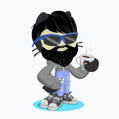

<body>

## MICHEL GHISLAIN 

<h1> sommaire

<ol>                                         
    <li><a href="#part1" >études </li>  
    <li><a href="#part2" >profession </li>
    <li><a href="#part3" >ambition </li>
    
 </ol>

 école 

    
|      |   Baccalauréat scientifique option physique/chimie promo 2002  |
| :---: | --- |
|      | 2002 IUT GTR Genie Telecomunication Réseau   2003-2004 Licence 1 & 2 Maths option informatique :   ___découverte des langages informatiques___ |

 profession 

|     |   2002-2006 D'équipier à Manager   2006-2017 de Manager à Assistant de Direction :   ___Travail d'équipe - productivité - organisation - leadership - rigueur___ |
|:---:|:---|
|      |    2017-2018 d'assistant de direction à Responsable de Magasin :   ___autonomie - anticipation - reporting - prévision___  |

 ambition 

    
|      |     2019 Developpeur informatique   __patient - obstiné - débrouillard - adore les casses têtes__   leitmotiv : [le café c'est la vie](https://www.youtube.com/watch?v=UGtKGX8B9hU) |

liens utiles [linkedin](https://www.linkedin.com/in/ghislain-michel-31b024153/) // [CV](CV_Ghislain_Michel (2019).pdf) 

 
  
